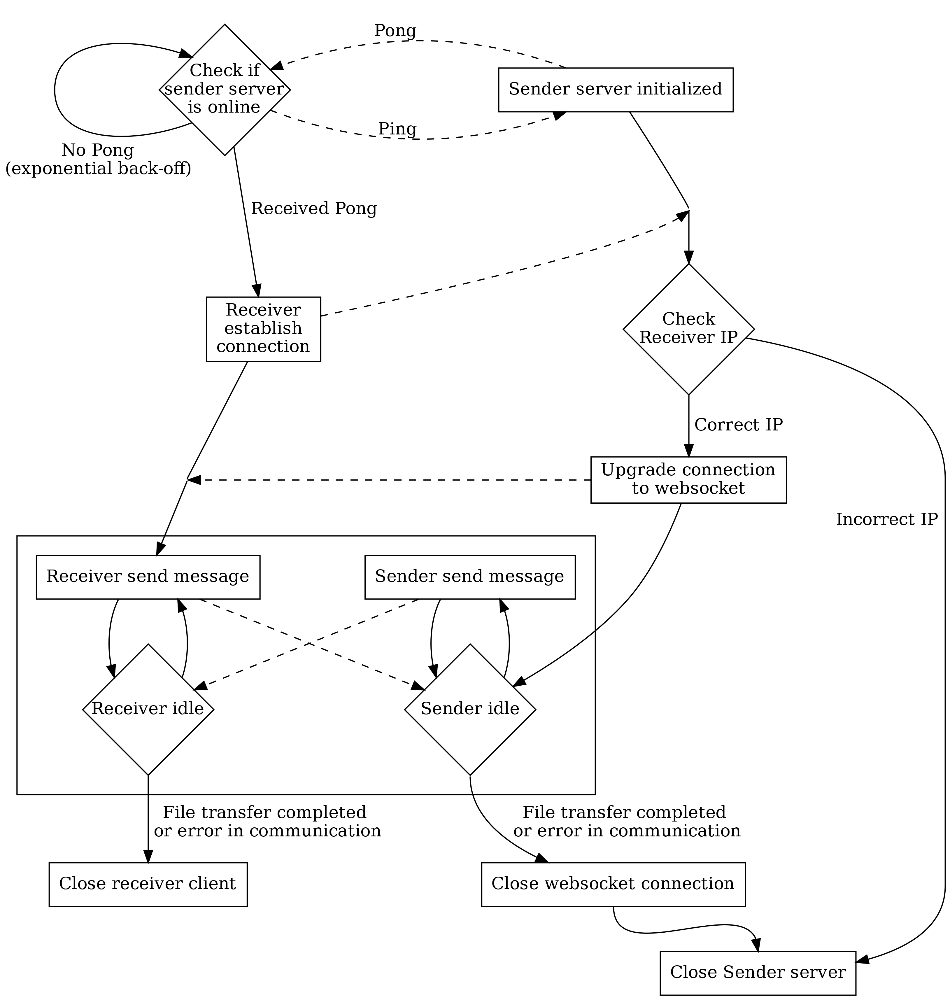
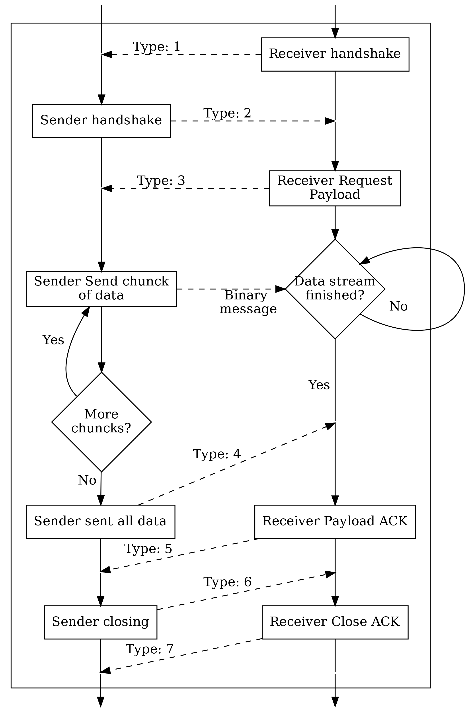

# portal
magic-wormhole, but worse

This is a project!

## Portal Transfer Protocol (PTP)

The Transfer Protocol makes use of websockets for control message signaling and file transfer. The `sender` will spin up a temporary web server with a websocket endpoint `/portal`. The receiver will hit said endpoint, the connection will be upgraded and the transfer sequence will begin. This State diagram gives a high-level overview over the initialization, transfer and closing sequences of the Protocol.

The squared of transfer sequence is explained in more detail in the following state-diagram.

The message `type` can be looked up in this here table,

| Type code    | Name                   | Direction    |
|--            | --                     | --           |
| 0            | Error                  | R ↔ S        |
| 1            | ReceiverHandshake      | R → S        |
| 2            | SenderHandshake        | S → R        |
| 3            | ReceiverRequestPayload | R → S        |
| 4            | SenderPayloadSent      | S → R        |
| 5            | ReceiverAckPayload     | R → S        |
| 6            | ReceiverClosing        | R → S        |
| 7            | SenderClosing          | S → R        |
| 8            | ReceiverClosingAck     | R → S        |
